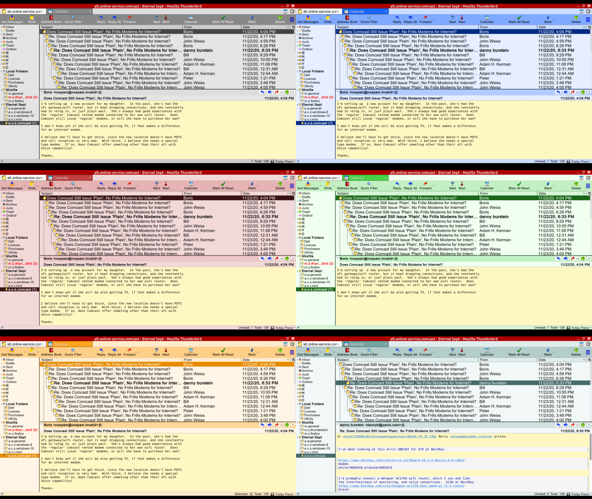
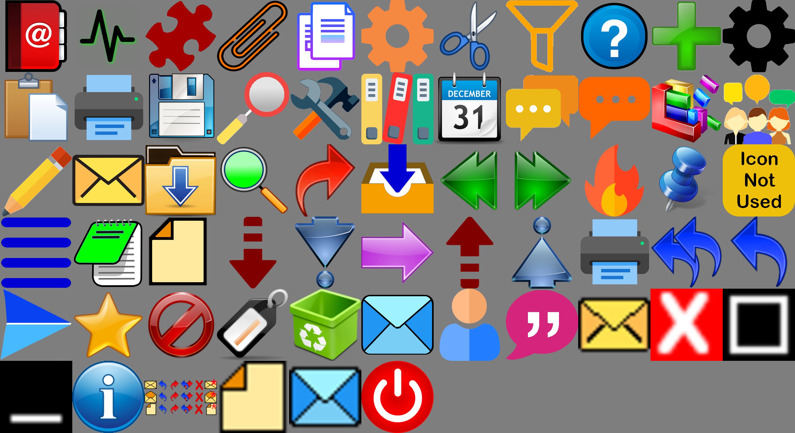

Thunderbird Chrome folder - customizations to colors, icons, spacing and fonts for Thunderbird V68+

<b>Installation</b> 
Put the entire chrome folder in your profile.  If there is one already there, rename it first.

<b>The Files</b> 
userChrome.css is a shell that simply imports other css files to make all this happen.

The colors folder contains the 6 color.css files that are selected in userChrome.css by uncommenting the desired theme color.  See samples in the Screen-Shots folder.
The colors can be adjusted in those css files if you don't like the current ones.  Is the blue to bright, then pick a different color and edit the blue.css file.

The images folder contains icons (all the svg) and 3 composite images. (message.png, images.png and compose.svg).  These are the images used to decorate the UI.

The PNG folder contains the individual icons used to build the images/images.png montage file that is used for decorations in the UI.  If you wish to change the PNG/icons, feel free to change them.  Once changed run the shell script to rebuild the images/images.png file.  Each image is numbered so they sort in the proper order in the images.png file.  It is imperative that you do not change the number.  You can change the name if it means something better to you but the number is necessary to maintain the order of the images.

The SVG folder contains the individual svg icons used to build the images/compose.svg file.

There are several GIMP files and svg files used to build the message.png file.  The ultimate end is to build a 144x72 px image that is used by message-icons.css to decorate the header pane.  They show the read,unread,replied,forwarded etc status of the individual headers in the header pane.

sizes.css controls most of the font sizes and item heights like toolbars and tabs.
Look here to change fonts/spacing first.  Not much is hard coded in userChrome*.css.

userContent.css is a simple css changing the coloring of the different quote levels when reading.

There are two user-chrome*css files.  One that uses Thunderbird's built in thread highlighting for tags (userChrome-basic.css) and one that uses my own highlighting for TAGS (userChrome-all.css).  I like mine better because the default is color background with white text, where TB uses color text on white, a bit less visible.

Import the userChrome-all.css file that will do my highlighting, or userChrome-basic.css that uses Thunderbird's highlighting.  Using Thunderbird's highlighting allows you to change tag colors and the highlighting follows your changes.  My highlighting is hard coded with the default colors and does not honor any color changes in settings.

<b>Why all the message files?</b> 
message-384x192.xcf is the GIMP file I used initially for message.png scaled 3 times larger for detail and must be rescaled before exporting to a png file.
message-144x72.xcf is the GIMP file scalled properly and some of the paper and envelope icons cleaned up after scaling kinda distored the images.
message.svg and message2.svg are not used, but are here if you work in inkscape easier that GIMP.
message-plain.xcf is very plain line drawn graphics if you are not into colorful graphics.
message.png -- the ultimate end to this all, must be 144x72 px no matter which item above you use and how you export it.

<b>Tweaks</b> 
As the chrome folder is setup, this is how I use it in my system.
With minor changes, this setup can go from version 68 to 78+ or from Linux to Windows.
There are minor issues between all 4 possible combinations of setup but for the whole it works.  Notes were made in sizes.css that seem to apply to my various Windows and Linux systems.  I use a variety of 1366x768, 1600x900 and 1920x1080 screens on my systems and VMs.

Example of the different colors currently available.

Example of the icons used.

Jan 2021
